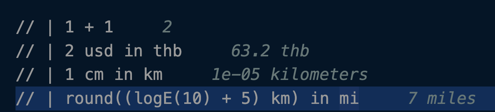
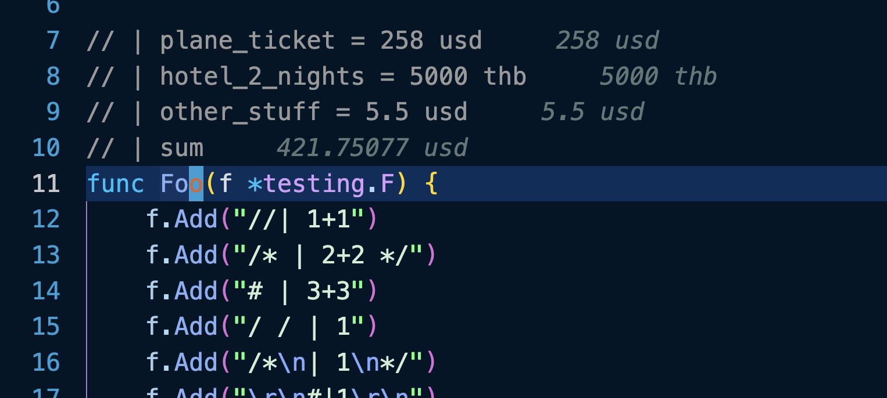

# Puter

# Supported Comments Type

```md
// 
# 
```

# Usage

Immediately after comment begin, put a pipe symbol and type in expressions.

```md
// | 1 + 1
// | 2 usd in thb
// | 1 cm in km 
// | (logE(10) + 5) kb to gb 
```



Or you can perform simple arithmetic operations on everything above current line.

```
plane_ticket = 258 usd
hotel_2_nights = 5000 thb
other_stuff = 5.5 usd
sum
```



# Syntax

Any math expressions followed by `unit` in `unit` with builtin functions support. 

## Supported Units

[Currencies](https://github.com/Khongchai/puter/blob/main/server/unit/currency_type.go)

[Everything else](https://github.com/Khongchai/puter/blob/main/server/unit/fixed_unit_type.go)

## Supported Math Functions

[Here](https://github.com/Khongchai/puter/blob/9ecb3f6fbc4e14ed9cef4dca87241f2e96970527/server/evaluation/evaluator/evaluator.go#L352)

# Puter Calculator

## More Examples

Download puter and copy everything below into a markdown file to see the result.

```javascript
// | 2 + 3
// | 10 - 4
// | 3 * 5
// | 10 / 2
// | 2 ^ 4
```

## Parentheses & Order of Operations

```javascript
// | 2 + 3 * 4
// | (2 + 3) * 4
// | 100 - 50 + 25
```

## Variables

```javascript
// | x = 5
// | y = x + 3
// | y * 2
```

## Number Formats

```javascript
// | 255 in hex
// | 100 in binary
// | 42 in decimal
```

## Currency Conversion

```javascript
// | 100 usd
// | 50 usd in thb
// | 1 usd + 200 thb
// | x = 2 in usd in thb
```

## Measurements

```javascript
// | 2 km in cm
// | (20 cm) + 1 m
// | 1000 m in km
```

## Percentages

```javascript
// | 5%
// | 100 + 10%
// | 50 usd + 20%
```

## Boolean Logic

```javascript
// | true && false
// | true || false
// | !true
// | 5 > 3
// | 10 <= 20
// | 5 == 5
// | 3 != 4
```

## Comparisons with Units

```javascript
// | 1 usd > 2 thb
// | 1m == 0.001km
// | 100 cm < 2 m
```

## Built-in Functions

```javascript
// | sqrt(16)
// | log10(100)
// | logE(2.718)
// | log2(8)
// | sin(1.57)
// | cos(0)
// | tan(0.785)
// | abs(-5)
// | round(3.7)
// | floor(3.9)
// | ceil(3.1)
```

## Interpolation Functions

```javascript
// | lerp(0, 10, 0.5)
// | invLerp(10, 20, 15)
```

## Line Accumulation

```javascript
// | 5
// | 3
// | 2
// | sum
```

```javascript
// | 2
// | 3
// | 4
// | product
```

```javascript
// | 5 thb
// | 3 thb
// | sum
```

## Mixed Operations

```javascript
// | x = 100 usd
// | y = x + 20%
// | y in thb
```

```javascript
// | distance = 5 km
// | distance in m
// | distance in cm
```

```python
# | price = 1000
# | tax = price * 7%
# | total = price + tax
```

## Works in Any Language

```go
// | revenue = 50000 usd
// | cost = 30000 usd
// | profit = revenue - cost
```

```python
# | a = 10
# | b = 20
# | sqrt(a^2 + b^2)
```

```rust
// | 2^10 in binary
```
